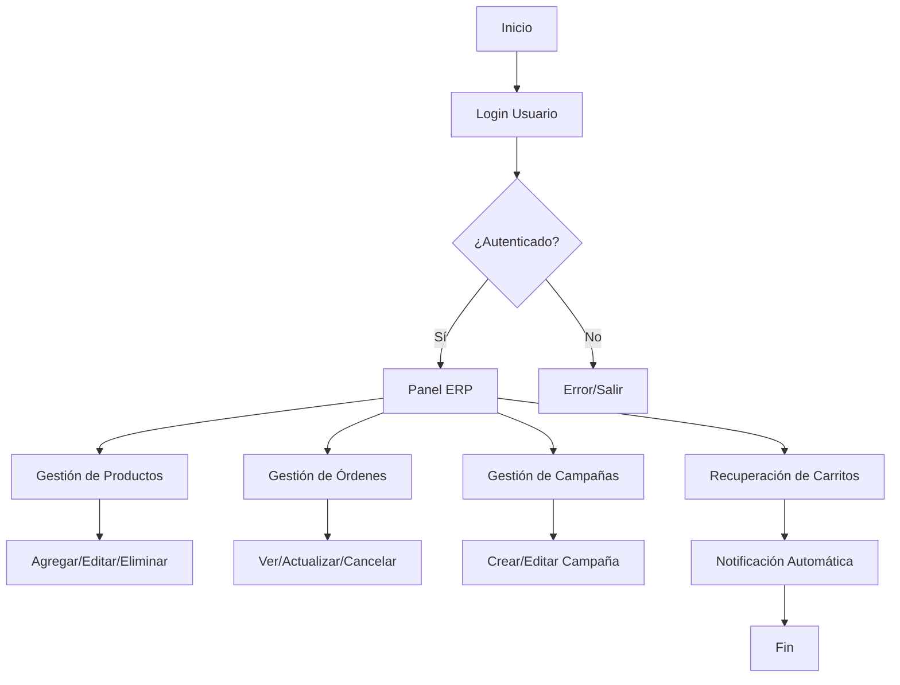
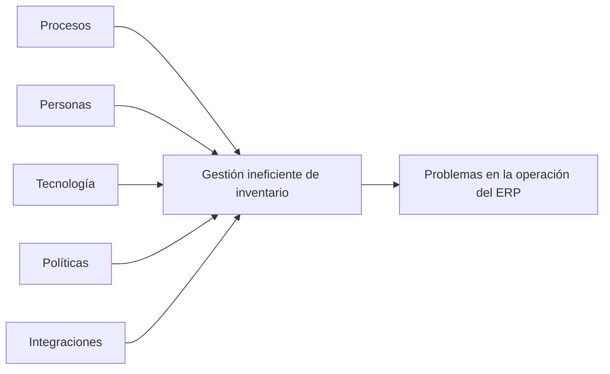

# Portada

**Título:** Desarrollo e Implementación de un ERP para Gestión de Tienda Online: Caso VITTOSTORE

**Autor:** [Tu Nombre Aquí]
**Institución:** [Tu Institución Aquí]
**Curso:** [Nombre del Curso]
**Profesor:** [Nombre del Profesor]
**Fecha:** 22 de abril de 2026

---

# Índice
1. Introducción
2. Misión
3. Visión
4. Propósito
5. Objetivo Específico
6. Objetivos Secundarios
7. Desarrollo
   - 7.1 Arquitectura del ERP
   - 7.2 Diagramas de Flujo
   - 7.3 Diagrama de Ishikawa
   - 7.4 Last Planner
8. Terminología Aplicada
9. Resumen
10. Bibliografía

---

# 1. Introducción
El presente informe, elaborado desde la perspectiva de la ingeniería civil industrial, expone el proceso de análisis, diseño, implementación y mejora continua de un sistema ERP para la gestión integral de tiendas online, tomando como caso de estudio la evolución de la aplicación VITTOSTORE. El enfoque se centra en la optimización de procesos, la integración de recursos tecnológicos y humanos, la gestión eficiente de la información y la toma de decisiones basada en datos, bajo estrictos estándares de seguridad, calidad y mejora continua.

# 2. Misión
Desarrollar un ERP robusto y seguro que optimice la gestión integral de tiendas online, promoviendo la eficiencia operativa, la automatización de procesos y la toma de decisiones informada, alineado con los principios de la ingeniería industrial y la gestión de operaciones.

# 3. Visión
Consolidarse como la solución líder en ERP para e-commerce, reconocida por su innovación, escalabilidad, eficiencia en la gestión de recursos y cumplimiento de estándares internacionales de seguridad, calidad y sostenibilidad.

# 4. Propósito
Proveer a los comercios electrónicos una plataforma centralizada que integre ventas, inventario, campañas y atención al cliente, permitiendo la optimización de recursos, la reducción de desperdicios, la mejora continua de procesos y la maximización del valor entregado al cliente.

# 5. Objetivo Específico
Implementar un ERP modular y escalable que permita gestionar productos, órdenes, campañas y recuperación de carritos, integrando herramientas de análisis de datos, automatización de notificaciones y conectividad con plataformas externas como Shopify, bajo un enfoque de mejora continua y gestión por procesos.

# 6. Objetivos Secundarios
- Garantizar la seguridad, integridad y privacidad de los datos gestionados.
- Automatizar procesos críticos, como notificaciones y recuperación de carritos, para reducir tiempos de respuesta y errores humanos.
- Facilitar la integración eficiente con plataformas externas (Shopify, WhatsApp) para ampliar el alcance funcional del ERP.
- Proveer reportes, indicadores clave de desempeño (KPIs) y métricas para la toma de decisiones estratégicas y operativas.
- Documentar, estandarizar y mejorar continuamente los procesos internos y externos.

# 7. Desarrollo
## 7.1 Arquitectura del ERP
El sistema ERP se estructura en módulos funcionales (productos, órdenes, campañas, usuarios y notificaciones), integrados mediante una API REST. Cada módulo responde a un proceso de negocio identificado y mapeado bajo la metodología de gestión por procesos. La arquitectura prioriza la interoperabilidad, la escalabilidad y la seguridad, utilizando autenticación robusta y cifrado de datos. El diseño modular permite la mejora continua y la adaptación a nuevas necesidades del negocio, siguiendo principios de la ingeniería industrial como la flexibilidad y la eficiencia de recursos.

## 7.2 Diagramas de Flujo

## 7.3 Diagrama de Ishikawa

## 7.4 Last Planner (Resumen)
- Definición de hitos: Integración con Shopify, desarrollo del módulo de notificaciones, ejecución de pruebas de seguridad y validación de procesos.
- Planificación colaborativa semanal: Asignación de tareas, responsables, plazos y recursos, utilizando herramientas de gestión visual y control de avance.
- Revisión diaria: Seguimiento de avances, identificación de restricciones, gestión de bloqueos y aplicación de acciones correctivas, bajo el enfoque de mejora continua y trabajo colaborativo.

# 8. Terminología Aplicada
- **ERP:** Enterprise Resource Planning, sistema de gestión empresarial que integra y automatiza procesos clave de la organización.
- **API REST:** Interfaz de programación de aplicaciones basada en HTTP, que permite la comunicación entre módulos y sistemas externos.
- **Webhook:** Mecanismo para recibir eventos externos y desencadenar acciones automáticas en el sistema.
- **Cifrado AES-256-GCM:** Algoritmo de cifrado avanzado utilizado para proteger la confidencialidad e integridad de los datos.
- **Notificación automática:** Proceso automatizado de envío de mensajes o alertas a usuarios o sistemas, optimizando la comunicación y reduciendo tiempos de respuesta.
- **Gestión por procesos:** Enfoque de administración que identifica, documenta y mejora los procesos clave para alcanzar los objetivos organizacionales.
- **KPIs:** Indicadores clave de desempeño utilizados para medir la eficiencia y eficacia de los procesos.

# 9. Resumen
El proyecto, abordado desde la ingeniería civil industrial, evolucionó de una aplicación de gestión de tienda a un ERP modular y escalable, integrando principios de optimización de procesos, gestión de recursos, seguridad de la información y mejora continua. Se aplicaron metodologías de análisis sistémico, diagramas de flujo, análisis de causas raíz (Ishikawa) y planificación colaborativa (Last Planner), asegurando la alineación con los objetivos estratégicos y operativos de la organización, y contribuyendo a la eficiencia, calidad y sostenibilidad del sistema implementado.

# 10. Bibliografía
- Shopify Dev Docs: https://shopify.dev/docs
- ISO/IEC 27001 Seguridad de la Información
- Project Management Institute (PMI). (2017). Guía del PMBOK®
- Sommerville, I. (2016). Ingeniería de software (10ª ed.).
- Otras fuentes consultadas en la documentación del proyecto.

---

> **Nota:** Completa los campos de autor, institución, curso y profesor antes de entregar el informe final. Los diagramas pueden exportarse a imágenes para Word/PDF.
